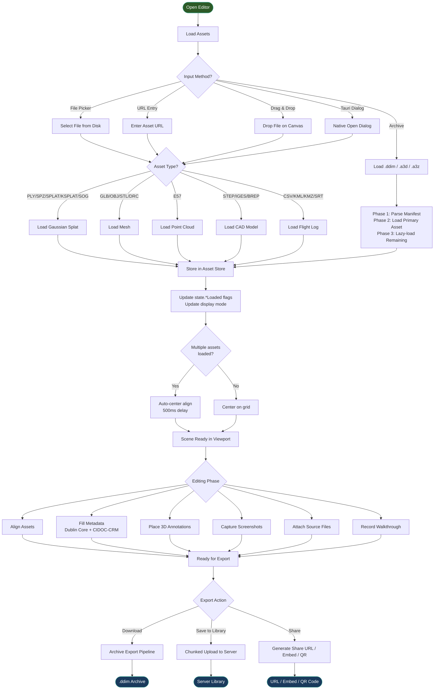
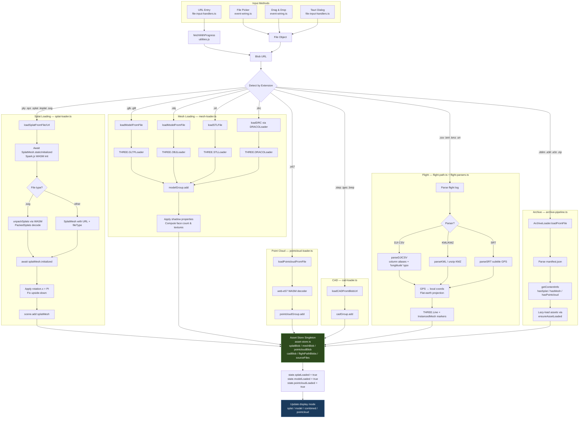
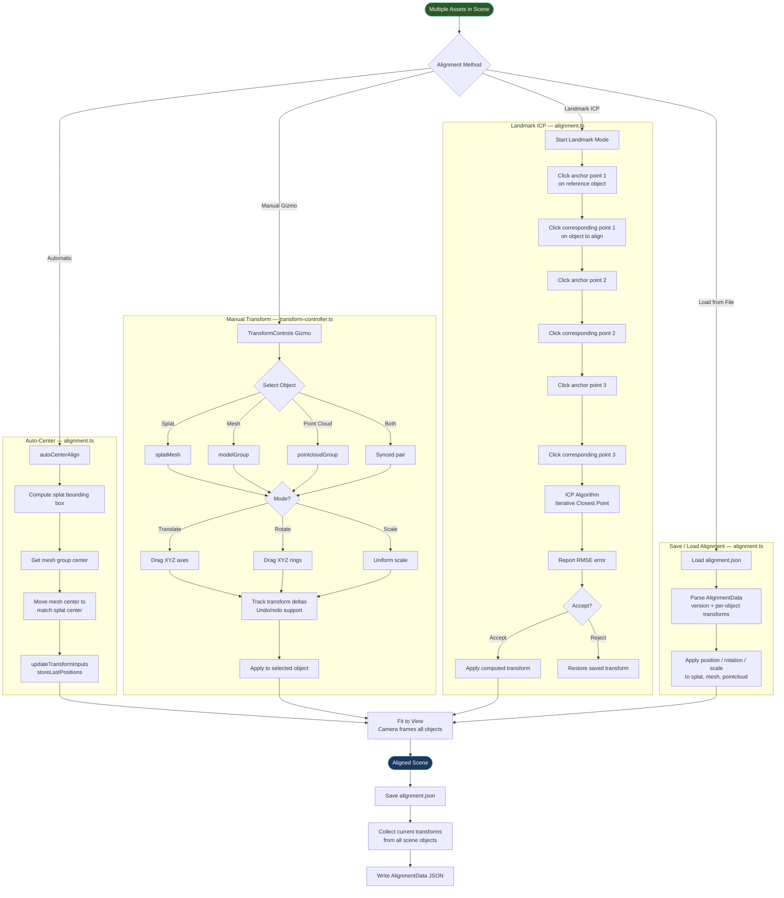
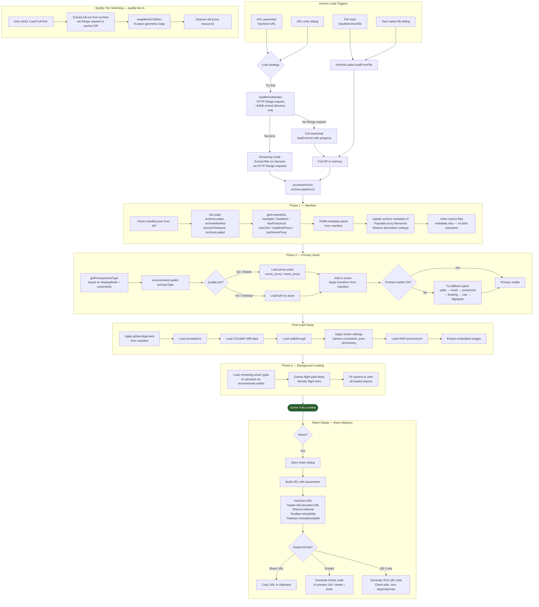

# Archive Creation Workflow

Visual documentation of the complete archive creation lifecycle in Vitrine3D's Editor mode — from loading assets through alignment, metadata, export, and sharing.

> **Rendering**: These charts use [Mermaid](https://mermaid.js.org/) syntax. They render natively on GitHub, in VS Code (with the Mermaid extension), or at [mermaid.live](https://mermaid.live).

---

## 1. Main Workflow Overview

End-to-end flow from opening the Editor through asset loading, editing, and export/sharing.

---

## 2. Asset Loading Detail

How different asset types flow through their respective loaders into the shared Asset Store.

---

## 3. Alignment & Transform

Four alignment methods available after loading multiple assets into the scene.

---

## 4. Archive Export Pipeline

Detailed export flow from clicking "Download Archive" through validation, asset processing, and output.

```mermaid
flowchart TD
    ExportClick([User Clicks Export]) --> ShowPanel["Show export pane<br/>Sync asset checkboxes<br/>based on state.*Loaded"]

    ShowPanel --> UserConfig["User configures:<br/>• Asset checkboxes — splat / mesh / pc / annotations<br/>• Format — .ddim or .zip<br/>• Draco HD compression<br/>• Splat LOD toggle"]

    UserConfig --> PrepareArchive["prepareArchive<br/>export-controller.ts"]

    PrepareArchive --> CollectMeta["collectMetadata<br/>from metadata panel"]
    CollectMeta --> InjectSettings["Inject measurement calibration<br/>and rendering preset<br/>into viewer settings"]

    InjectSettings --> ValidateTitle{Title set?}
    ValidateTitle -->|No| ShowMetaPanel["Show metadata panel<br/>with warning"]
    ShowMetaPanel --> Abort([Export Aborted])
    ValidateTitle -->|Yes| SIPCheck

    SIPCheck["SIP Compliance Validation<br/>validateSIP with active profile<br/>basic / standard / archival"]
    SIPCheck --> SIPResult{Errors or<br/>warnings?}
    SIPResult -->|None| ContinueExport
    SIPResult -->|Yes| ComplianceDialog["Show compliance dialog<br/>Score %, errors, warnings"]
    ComplianceDialog --> UserDecision{User decision?}
    UserDecision -->|Back| ShowMetaPanel
    UserDecision -->|Export Anyway| OverrideExport[Mark compliance as overridden]
    UserDecision -->|Continue| ContinueExport

    OverrideExport --> ContinueExport

    ContinueExport["Reset archive creator<br/>Set all metadata sections"]

    ContinueExport --> ProcessAssets

    subgraph ProcessAssets["Asset Processing"]
        direction TB
        CheckSplat{Splat included?}
        CheckSplat -->|Yes| SplatLOD{"LOD enabled &<br/>non-SPZ format?"}
        SplatLOD -->|Yes| TranscodeSPZ["Transcode to SPZ<br/>via Web Worker"]
        SplatLOD -->|No| SplatDirect[Use original blob]
        TranscodeSPZ --> AddSplat[addScene to archive]
        SplatDirect --> AddSplat

        CheckMesh{Mesh included?}
        CheckMesh -->|Yes| DracoCheck{"Draco HD checked<br/>& GLB format?"}
        DracoCheck -->|Yes| DracoCompress["dracoCompressGLB<br/>mesh-decimator.ts"]
        DracoCheck -->|No| MeshDirect[Use original blob]
        DracoCompress --> AddMesh[addMesh to archive]
        MeshDirect --> AddMesh

        CheckPC{Point cloud<br/>included?}
        CheckPC -->|Yes| AddPC[addPointcloud to archive]

        AddProxies["Re-extract & add proxy assets<br/>mesh proxy / splat proxy"]
        AddOther["Add remaining:<br/>CAD / flight paths / COLMAP /<br/>HDR environment"]
    end

    ProcessAssets --> AddAlignment["setAlignment<br/>splat / mesh / pointcloud transforms<br/>+ camera position + orbit target"]

    AddAlignment --> AddAnnotations{Annotations<br/>included?}
    AddAnnotations -->|Yes| SetAnnotations["setAnnotations — JSON array<br/>3D position + camera state + content"]
    AddAnnotations -->|No| AddExtras

    SetAnnotations --> AddExtras
    AddExtras["Add walkthrough, embedded images,<br/>source files, detail models"]

    AddExtras --> StampCompliance["Set metadata profile<br/>Stamp SIP compliance record<br/>Set quality stats"]

    StampCompliance --> CapturePreview{Manual preview<br/>set?}
    CapturePreview -->|Yes| UseManual[Use manual preview blob]
    CapturePreview -->|No| AutoCapture["captureScreenshot<br/>Hide grid helpers, render to PNG"]
    UseManual --> AddThumbnail[addThumbnail preview.jpg]
    AutoCapture --> AddThumbnail

    AddThumbnail --> AddScreenshots["Add screenshot list<br/>screenshot_N.jpg"]

    AddScreenshots --> Validate[archiveCreator.validate]
    Validate --> ValidResult{Valid?}
    ValidResult -->|No| ErrorNotify[notify.error with issues]
    ErrorNotify --> Abort2([Export Aborted])
    ValidResult -->|Yes| OutputChoice{Output target?}

    OutputChoice -->|Download| CreateZIP["Streaming ZIP via fflate<br/>with progress callback"]
    OutputChoice -->|Library| CreateBlob["createArchive as Blob<br/>0–80% progress"]

    CreateZIP --> BrowserDownload([Browser Download<br/>project.ddim])

    CreateBlob --> ChunkUpload["Chunked upload to /api/archives<br/>50MB chunks, sequential"]
    ChunkUpload --> ServerSave([Saved to Server Library])

    style ExportClick fill:#2d5a27,stroke:#4a9,color:#fff
    style BrowserDownload fill:#1a3a5c,stroke:#68b,color:#fff
    style ServerSave fill:#1a3a5c,stroke:#68b,color:#fff
    style Abort fill:#5c1a1a,stroke:#c66,color:#fff
    style Abort2 fill:#5c1a1a,stroke:#c66,color:#fff
```

---

## 5. Archive Loading & Sharing

How archives are loaded back (from file or URL), processed in phases, and shared.

---

## Typical Configurations

### Splat Only
> File Picker → splat-loader.ts → Asset Store (`splatBlob`) → `state.splatLoaded = true` → `displayMode = splat` → center on grid → fill metadata → export (`addScene` only)

### Splat + Mesh (Aligned)
> Load splat → load mesh → **auto-center align** (500ms delay) → manual gizmo refinement _or_ landmark ICP → export (`addScene` + `addMesh` + `setAlignment` with both transforms)

### Full Scan Deliverable
> Load **splat + mesh + point cloud + flight log** → auto-center align → **landmark ICP** for precision → fill Dublin Core metadata (standard or archival profile) → place annotations → capture screenshots → export with **Draco compression** on GLB + **SPZ transcoding** on splat → `.ddim` archive containing `manifest.json`, `assets/`, `sources/`, `preview.png`
